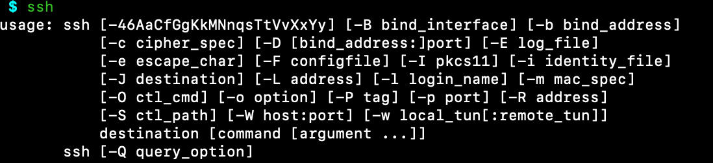
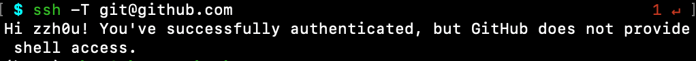
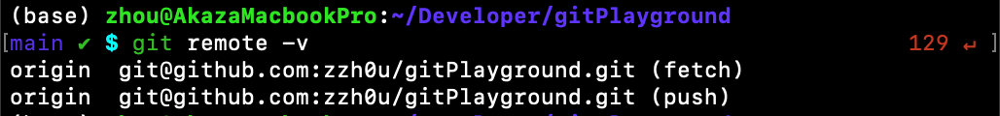

在[第一篇博客](https://zzh0u.github.io/blog/git-flow-part-1/)，我们熟悉了 Git 的基本流程，包括初始化、添加、提交、推送、拉取等操作。在这篇博客中，我们将继续介绍 Git 远程操作，包括远程仓库的创建、推送、拉取等操作。在这篇博客中，我默认大家都有自己的 [GitHub](https://github.com) 账号。

### 远程仓库是什么

Git 远程仓库是存储在远程服务器上的 Git 仓库，允许多个开发者共享和协作。常见的远程仓库托管平台包括 GitHub、GitLab 等。

### 为什么要使用远程仓库

1. **协作开发**：多个开发者可以同时访问和修改同一项目，通过推送和拉取操作同步代码。

2. **备份与恢复**：远程仓库作为代码的备份，防止本地数据丢失时无法恢复。

3. **版本控制**：记录所有提交历史，便于追踪代码变更和回滚到之前的版本。

4. **持续集成与部署**：远程仓库可与 CI/CD 工具集成，自动化测试和部署流程。

5. **代码审查**：通过 Pull Request 或 Merge Request 机制，便于团队成员进行代码审查。

6. **开源贡献**：开发者可以克隆开源项目，修改后提交更改，促进开源社区的发展。

### 准备工作

在使用 Git 之前，我们需要配置一些基本信息，包括用户名和邮箱地址。可以通过以下命令设置：

```bash
git config --global user.name "Your Name"
git config --global user.email "email@example.com"
## 此处用户名和邮箱应和你 GitHub 的保持一致，这样别人在查看你的提交记录时，就知道是谁提交的。
```

接下来，你拥有了一个 GitHub 账号之后，就可以自由的 clone 或者下载其他项目，也可以创建自己的项目，但是你没法提交代码，如果随意可以提交代码，那么 GitHub 上的项目岂不乱了套了，所以提交代码之前一定是需要某种授权的。而 GitHub 上一般都是基于 SSH 授权的，通过账号密码的 http 授权已经被弃用了。那么什么是 SSH 呢？ 简单点说，SSH是一种网络协议，用于计算机之间的加密登录。而大多数 Git 服务器都会选择使用 SSH 公钥来进行授权，所以想要在 GitHub 提交代码的第一步就是要先添加 SSH key 配置。

Linux 与 Mac 都是默认安装了 SSH，而 Windows 系统安装了 Git Bash 应该也是带了 SSH 的。大家可以在终端（ Windows 下在 Git Bash 里）输入 ssh，如果出现以下提示证明你本机已经安装 SSH，否则请搜索自行安装。



紧接着输入 `ssh-keygen -t rsa`。就是指定 rsa 算法生成密钥，接着连续三个回车键（不需要输入密码），然后就会生成两个文件 `id_rsa` 和 `id_rsa.pub` ，而 `id_rsa` 是密钥，`id_rsa.pub` 就是公钥。这两文件默认分别在如下目录里生成：Linux/Mac 系统 在 `~/.ssh` 下，win系统在 `c/Documents and Settings/username/.ssh` 下，都是隐藏文件，相信你们有办法查看的。接下来要做的是把 `id_rsa.pub` 的内容添加到 GitHub 上，这样你本地的 `id_rsa` 密钥和 GitHub 上的 `id_rsa.pub` 公钥进行配对，授权成功才可以提交代码。

接下来在你的 [GitHub Settings](https://github.com/settings/profile) 中，点击 `SSH and GPG keys` ，然后点击 `New SSH key` ，把 `id_rsa.pub` 的内容复制到 `Key` 框里，然后点击 `Add SSH key` ，就完成了 SSH 配置。


添加成功后，在终端输入 `ssh -T git@github.com`，如果出现以下提示，证明 SSH 配置成功。



好啦，到这里，准备工作圆满完成：）

### 关联远程仓库

在这里，我已经创建好了一个远程仓库，大家可以直接用 `git clone git@github.com:zzh0u/gitPlayground.git` 克隆下来，然后在本地修改，提交代码，然后推送到远程仓库；也可以自己创建一个远程仓库，效果是一样的。这里可以用 `git remote -v` 命令查看远程仓库。



### 推送

当你在本地对项目文件进行修改并提交 commit 后，就可以通过 `git push origin main` 命令将本地的修改推送到远程仓库。这里值得注意的是，`origin` 是 git 默认的远程仓库别名，`main`默认的是本地分支名称。处于一些个性化需求，你可以使用 `git remote rename origin newname` 命令来修改远程仓库的别名。关于分支的知识和另外一个命令 `git pull`，会在后一篇分支管理中讲到。
