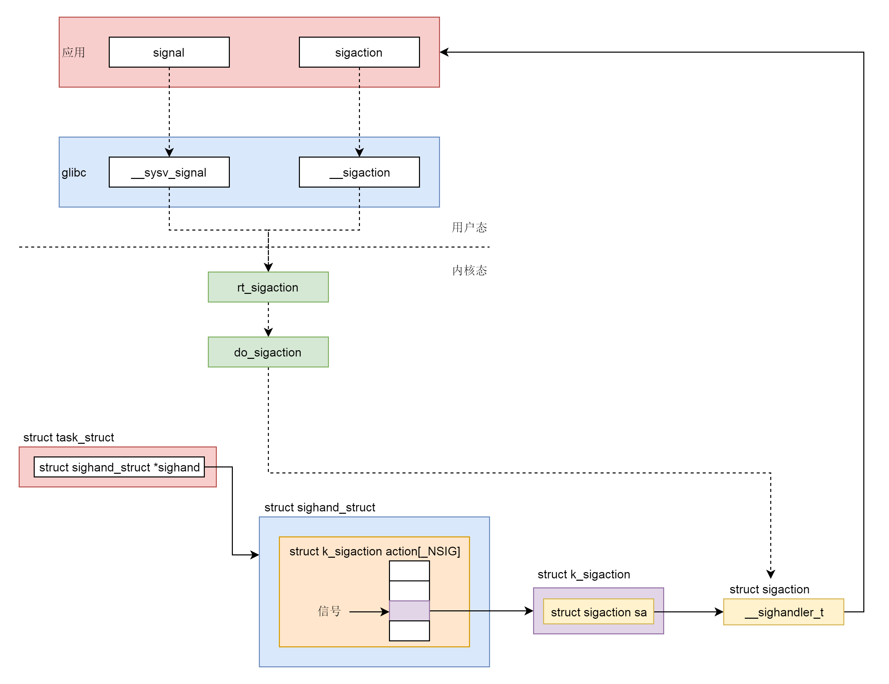

## **Linux 信号**

信号本质上是整数，用户模式下用来模拟硬件中断。

- 什么是硬件中断？先理解为硬件引发的中断。
- 什么是中断？简言之，就是让 CPU 停下当前干的事转而去处理新的情况。
- 信号是谁产生的？可以由硬件、内核和进程产生。

例如在终端上用`Ctrl+C`，可以结束掉当前终端进程，本质上是发送 SIGINT 信号。

如下是一个实例程序，该程序循环打印数字。运行起来，看看`Ctrl+C`能不能中止它：

```c
#include <stdio.h>
#include <unistd.h>
#include <signal.h>
#include <stdbool.h>

void hand(int val)
{
    printf("val: %d\n",val);
    printf("Do you want to kill me? No way!\n");
}

int main()
{
    signal(SIGINT,hand);
    int n = 0;
    while (true) {
        printf("n:%d\n",n++);
        sleep(1);
    }
    return 0;
}
```

如下所示，现在使用 Ctrl+C 是没办法中断这个程序的：


这里可以用 man 命令查看一下 signal 函数的帮助文档：


signal 关联上了一个信号处理函数，来处理信号。

现在修改这个代码，添加一行打印当前进程号，然后打开两个终端，一个终端运行上面的程序，一个终端尝试`kill`命令来发送信号：


kill 要指定参数：


这是可行的，结果如上。

**信号处理的过程**

进程 A 在运行，内核、硬件或者其他进程发送信号给进程 A。进程 A 接收到信号后，直接做信号本身规定的对应处理或者做事先注册好的信号处理。如上面 signal 函数就是注册信号处理，hand 函数替换了本身默认的信号处理。当然信号是可以屏蔽的，不作任何处理。

Linux 有哪些信号类型：


Linux 信号有 64 个，分为不可靠信号(非实时，1-31，Unix 提供)和可靠信号(32-64，后来扩充的)。又有系统自带的标准信号和用户自定义的信号。

介绍几个命令或函数：

- 信号注册：`signal`、`sigaction;`
- 信号发送：`kill`命令、`kill`函数、`sigqueue;`
- 信号屏蔽：`sigprocmask`;
- 信号集：`sigset_t`.

下面写一个发送信号的程序：

```c
#include <stdio.h>
#include <unistd.h>
#include <signal.h>
#include <stdlib.h>

int main(int argc,char* argv[])
{
    int pid = atoi(argv[1]);
    int sig = atoi(argv[2]);

    printf("pid:%d  sig:%d\n",pid,sig);
    kill(pid,sig);
    return 0;
}
```


成功发送了信号。

`sigaction`函数有所不同，功能更多：


这里用到了一个结构体：


结构体的第一个成员依然是原来的信号处理函数，第二个成员被称作高级信号处理函数，第三个成员用于信号屏蔽，剩下两个暂时还用不到。

这个函数不仅可以发信号、做信号处理，还可以接收信号的同时接收数据

下列代码使用了高级信号处理：

```c
#include <stdio.h>
#include <unistd.h>
#include <signal.h>
#include <stdbool.h>

// 基本信号处理函数
void hand(int n)
{
    printf("基本信号处理函数\n");
}

// 高级信号处理函数
void handler(int n,siginfo_t* siginfo,void* arg)
{
    printf("高级信号处理函数\n");
    printf("n:%d msg:%d\n",n,siginfo->si_int);
}

int main(void)
{
    struct sigaction act = {0};
    struct sigaction old_act = {0};
    act.sa_handler = hand;
    act.sa_sigaction = handler;
    act.sa_flags = SA_SIGINFO;

    // 高级信号处理
    sigaction(2,&act,&old_act);
    printf("pid:%d\n",getpid());

    int n = 0;
    while (true) {
        printf("n:%d\n",n++);
        sleep(1);
    }
    return 0;
}
```

同时还要实现高级的信号发送，采用`sigqueue`：


这里有个重要的联合体，用来存储数据和信号一起发送：


```c
#include <stdio.h>
#include <unistd.h>
#include <signal.h>
#include <stdlib.h>

int main(int argc,char* argv[])
{
    int pid = atoi(argv[1]);
    int sig = atoi(argv[2]);
    printf("pid:%d  sig:%d\n",argv[1],argv[2]);
    union sigval u;
    u.sival_int = 12345678;
    sigqueue(pid,sig,u);
    return 0;
}
```

运行结果如下：


可以看到程序接收到了信号和数据。

也试试发送其他数据，联合体中还有一个指针类型的成员。

## Linux 信号(续)

> 参考网站: Github、《极客时间》

现在从底层角度来观赏 Linux 信号机制。

首先看信号的具体作用：


如上文所提，处理信号有 3 种方式：执行默认操作，捕获信号和忽略信号

设置信号处理有两种方式: signal 和 sigaction

signal 将一个动作和信号关联，sigaction 也是将一个动作和信号关联，但这个动作用一个结构体表示了，处理信号将更加细致

siganal 不是系统调用，而是 glibc 封装的一个函数，实现如下：

```c
#  define signal __sysv_signal
__sighandler_t
__sysv_signal (int sig, __sighandler_t handler)
{
  struct sigaction act, oact;
......
  act.sa_handler = handler;
  __sigemptyset (&act.sa_mask);
  act.sa_flags = SA_ONESHOT | SA_NOMASK | SA_INTERRUPT;
  act.sa_flags &= ~SA_RESTART;
  if (__sigaction (sig, &act, &oact) < 0)
    return SIG_ERR;
  return oact.sa_handler;
}
weak_alias (__sysv_signal, sysv_signal)
```

这里可以看到 sa_flags 设置了一个 SA_ONESHOT，这意味着信号处理函数只作用一次，用完一次后就返回默认行为

同时设置了 SA_NOMASK，通过 \_\_sigemptyset，将 sa_mask 设置为空。这样的设置表示在这个信号处理函数执行过程中，如果再有其他信号，哪怕相同的信号到来的时候，这个信号处理函数会被中断。如果一个信号处理函数真的被其他信号中断，问题也不大，因为当处理完了其他的信号处理函数后，还会回来接着处理这个信号处理函数的，但是对于相同的信号就有点尴尬了。一般的思路应该是，当某一个信号的信号处理函数运行的时候，暂时屏蔽这个信号，屏蔽并不意味着信号一定丢失，而是暂存，这样能够做到信号处理函数对于相同的信号，处理完一个再处理下一个，这样信号处理函数的逻辑要简单得多。

还有一个设置就是设置了 SA_INTERRUPT，清除了 SA_RESTART。信号的到来时间是不可预期的，有可能程序正在调用某个漫长的系统调用的时候，突然到来一个信号，中断了这个系统调用，去执行信号处理函数。那么执行完后信号处理函数，系统调用怎么办？

时候有两种处理方法，一种就是 SA_INTERRUPT，也即系统调用被中断了，就不再重试这个系统调用了，而是直接返回一个 -EINTR 常量，告诉调用方，这个系统调用被信号中断了，调用方可以根据自己的逻辑，重新调用或者直接返回，这会使得代码非常复杂，在所有系统调用的返回值判断里面，都要特殊判断一下这个值。

另外一种处理方法是 SA_RESTART。这个时候系统调用会被自动重新启动，不需要调用方自己写代码。当然也可能存在问题，例如从终端读入一个字符，这个时候用户在终端输入一个'a'字符，在处理'a'字符的时候被信号中断了，等信号处理完毕，再次读入一个字符的时候，如果用户不再输入，就停在那里了，需要用户再次输入同一个字符。

可知 signal 函数是受到限制的，因此，建议使用 sigaction 函数，根据自己的需要定制参数。

下面是 glibc 中的实现：

```c
int
__sigaction (int sig, const struct sigaction *act, struct sigaction *oact)
{
......
  return __libc_sigaction (sig, act, oact);
}


int
__libc_sigaction (int sig, const struct sigaction *act, struct sigaction *oact)
{
  int result;
  struct kernel_sigaction kact, koact;


  if (act)
    {
      kact.k_sa_handler = act->sa_handler;
      memcpy (&kact.sa_mask, &act->sa_mask, sizeof (sigset_t));
      kact.sa_flags = act->sa_flags | SA_RESTORER;


      kact.sa_restorer = &restore_rt;
    }


  result = INLINE_SYSCALL (rt_sigaction, 4,
                           sig, act ? &kact : NULL,
                           oact ? &koact : NULL, _NSIG / 8);
  if (oact && result >= 0)
    {
      oact->sa_handler = koact.k_sa_handler;
      memcpy (&oact->sa_mask, &koact.sa_mask, sizeof (sigset_t));
      oact->sa_flags = koact.sa_flags;
      oact->sa_restorer = koact.sa_restorer;
    }
  return result;
}
```

内核代码注释表明，系统调用 signal 是为了兼容过去，系统调用 sigaction 也是为了兼容过去，连参数都变成了 struct compat_old_sigaction，所以说，我们的库函数虽然调用的是 sigaction，到了系统调用层，调用的可不是系统调用 sigaction，而是系统调用 rt_sigaction。

在 `rt_sigaction` 里面，将用户态的 struct sigaction 结构，拷贝为内核态的 `k_sigaction`，然后调用 `do_sigaction`。

`do_sigaction` 也很简单，进程内核的数据结构里，struct task_struct 里面有一个成员 sighand，里面有一个 action。

这是一个数组，下标是信号，内容就是信号处理函数，`do_sigaction` 就是设置 sighand 里的信号处理函数。

```c
int do_sigaction(int sig, struct k_sigaction *act, struct k_sigaction *oact)
{
  struct task_struct *p = current, *t;
  struct k_sigaction *k;
  sigset_t mask;
......
  k = &p->sighand->action[sig-1];


  spin_lock_irq(&p->sighand->siglock);
  if (oact)
    *oact = *k;


  if (act) {
    sigdelsetmask(&act->sa.sa_mask,
            sigmask(SIGKILL) | sigmask(SIGSTOP));
    *k = *act;
......
  }


  spin_unlock_irq(&p->sighand->siglock);
  return 0;
}
```

总结：


