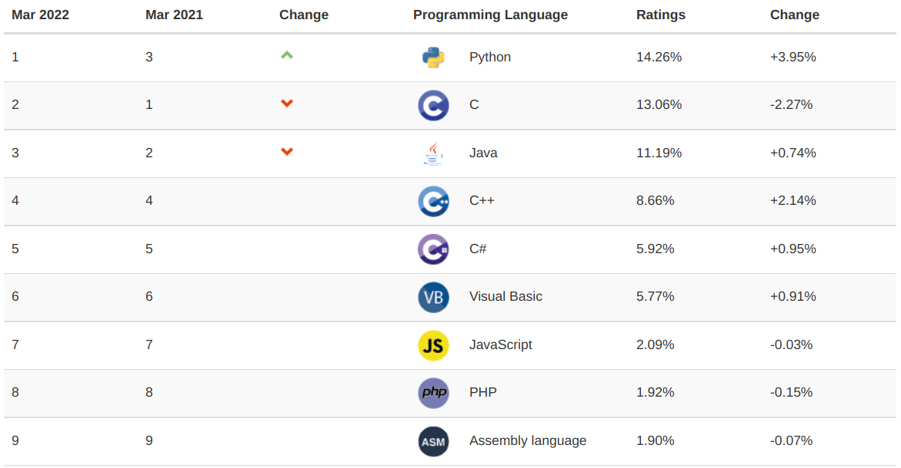
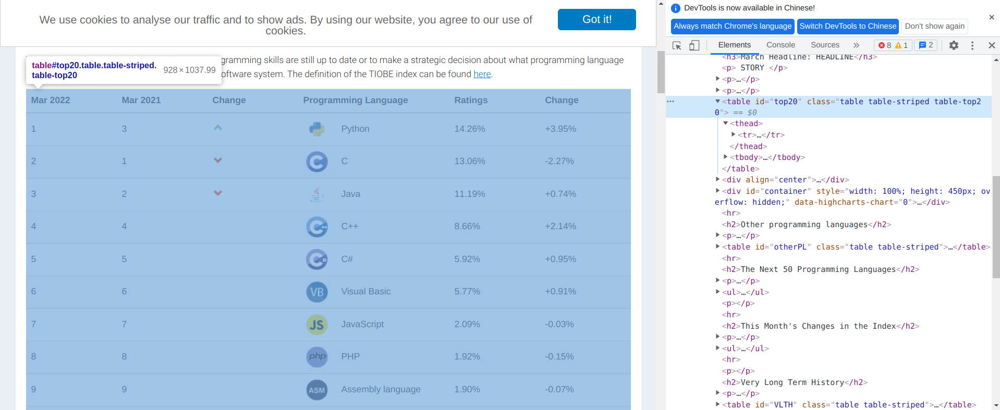
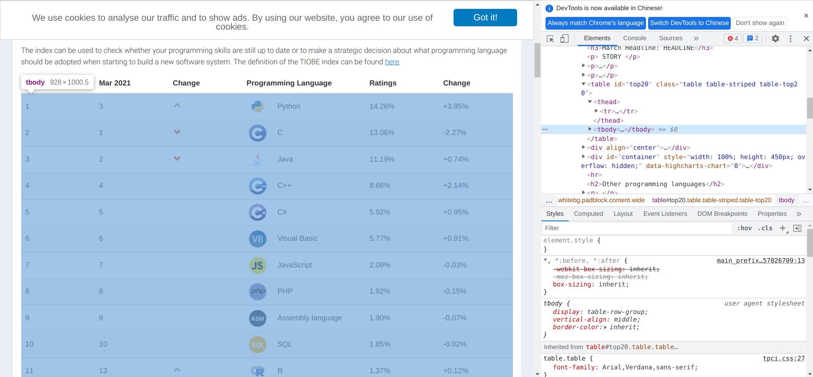
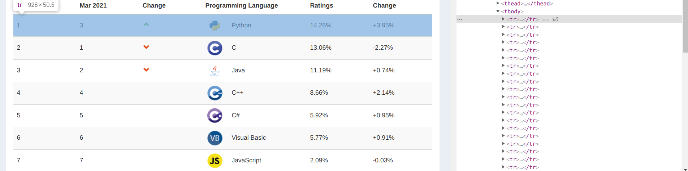
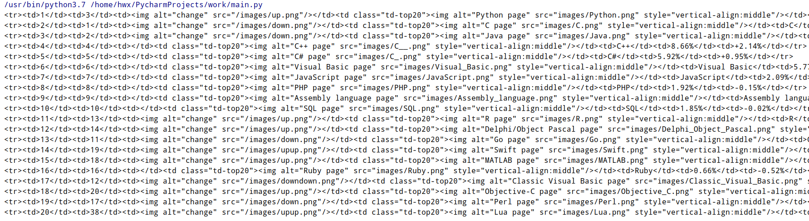
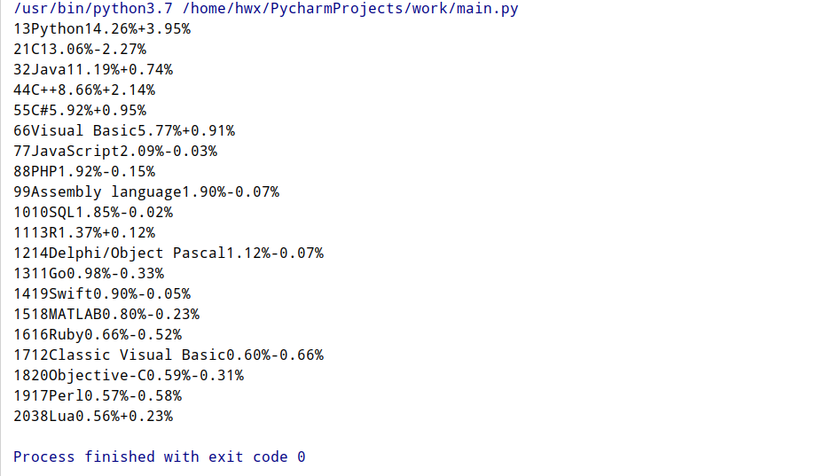
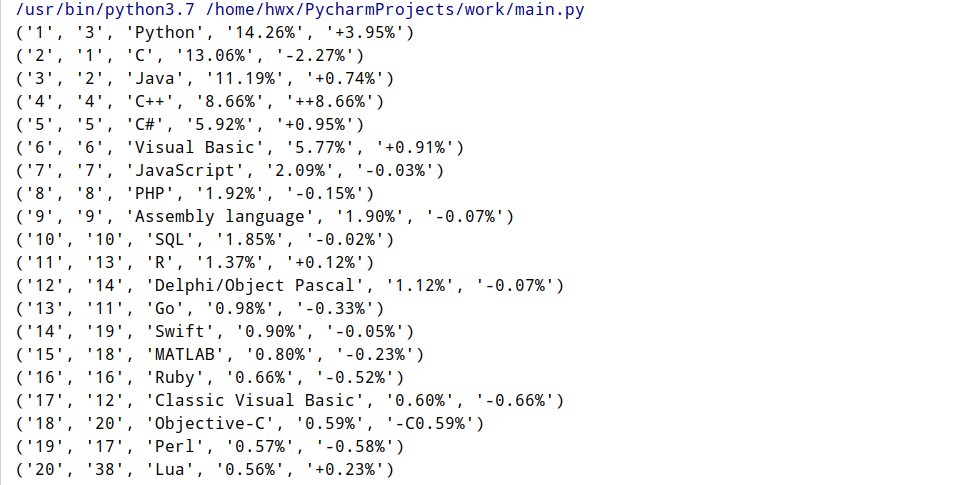
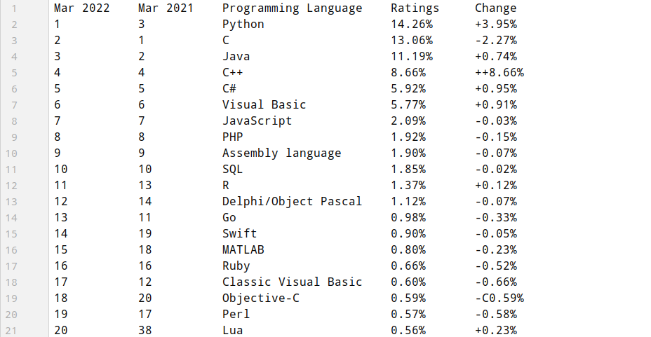
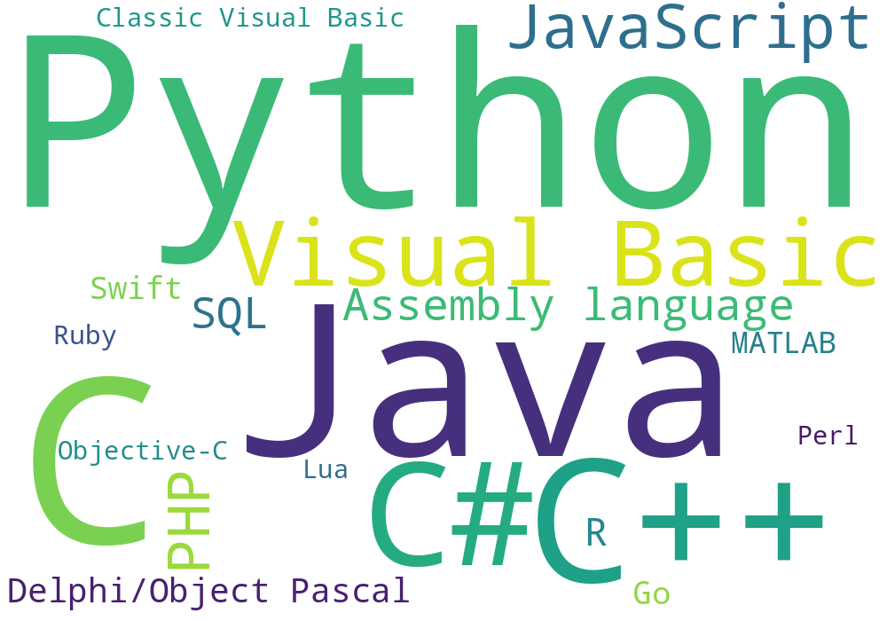

## Python 爬虫实战 - 爬取 TIOBE TOP20 语言排行榜

URL: [index | TIOBE - The Software Quality Company](https://www.tiobe.com/tiobe-index/)

IDE: PyCharm Professional

要爬取的是排名前 20 的语言榜单，并将其存成文本文件和生成词云。



这个榜单包括 6 列，分别是 2022 年 3 月的排名(Mar 2022)、2021 年 3 月的排名(Mar 2021)、增减、程序语言(Programming Language)、占比(Ratings)、变化率(Change)。

#### 前置准备

导入要用的库：

```python
import requests
from bs4 import BeautifulSoup
import re
import wordcloud
```

requests 是用来发起 https 请求，并获取结果的。BeautifulSoup 用于解析网页 html 代码，re 用于正则匹配，wordcloud 用于生成词云。

检查网页源代码，可以发现整个榜单放 id 为 top20 的 table 标签下：



榜单的主体在这个 table 标签的 tbody 标签下：



而每一行都被划分在 tbody 一个 tr 标签下：



知道这些就足够了，下面编写代码。

#### 获取数据

```python
url = "https://www.tiobe.com/tiobe-index/"
res = requests.get(url)
soup = BeautifulSoup(res.text,"html.parser")
table = soup.find("table", id="top20").find("tbody").find_all("tr")
```

上述代码获取了网页 html 源码并解析，返回一个 soup 对象，使用 find 和 find_all 函数根据标签查找，获取 tr 标签下数据组成的列表。

接下来将其打印出来看看：



打印出了每一个 tr 标签下的内容，要获取的数据就在其中：

```python
for item in table:
    print(item.text)
```

那直接取出文本：



现在拿到的数据就很间接了，程序将单个标签下所有的文本都连接到了一起。

现在已经获取到了数据，接下来要做的是数据处理。

#### 数据处理

现在获取的仅仅是文本，接下来要对其进行分割。

这时派上用场的是正则表达式。

这里使用 re 模块中的 search 函数：

```python
re.search(pattern, string, flags=0) # 扫描整个字符串并返回第一个成功的匹配。
```

| 参数    | 描述                                                                   |
| ------- | ---------------------------------------------------------------------- |
| pattern | 匹配的正则表达式                                                       |
| string  | 要匹配的字符串                                                         |
| flags   | 标志位，用于控制正则表达式的匹配方式，如：是否区分大小写，多行匹配等等 |

不难发现，在上面爬到的文本中，每一行的第一个数字就是语言的当前排名(1,2,3...)，因此这是固定的，后面紧跟的数字是去年排名，再跟着的若干单词是语言的名字，随后两个百分数就是占比和变化率。

那么每一次循环中，都是对一行的文本中数据的提取。

首先剔除每一行的第一个数字即当前排名，那么到字母之前剩下的数字就是去年排名，可以轻易的写出正则表达式"[0-9]+"，来匹配第一个出现的纯数字。

随后就是语言名字了，直接匹配第一个非数字字符串即可，即"\D+"。

接下来要匹配占比，显然这个百分数后面都会跟着一个正号或负号，因此表达式可以写成

"(\d+.([0-9]_?)%+)|(\d+.([0-9]_?)%-)"，最后剩下的是变化率，这个百分数之前都。有正负号，所以可以直接写出"-(._?)%|+(._?)%"。最后得到的结果用.group()函数取出即可。

每一行提取出的数据放到一个元组里：

```python
current_rand = 1
for item in table:
    if current_rand < 10:
        target = item.text[1:]
    else:
        target = item.text[2:]
    previous_rand = re.search(r"[0-9]+", target).group()
    language = re.search(r"(\D)+", target).group()
    ratings = re.search(r"(\d+\.([0-9]*?)%\+)|(\d+\.([0-9]*?)%-)", target).group()[:-1]
    change = re.search(r"-(.*?)%|\+(.*?)%", target).group()
    current_rand = current_rand + 1
```

再循环中将结果打印：



因为最后的结果要保存，所以要定义一个列表，将元组放到列表中。

考虑到要生成词云，所以同样要定义一个字典，与程序语言名称为 key，以占比为值，这里要把百分比的%去掉，然后转化为浮点数：

```python
words = {}
result = []
current_rand = 1
for item in table:
    if current_rand < 10:
        target = item.text[1:]
    else:
        target = item.text[2:]
    previous_rand = re.search(r"[0-9]+", target).group()
    language = re.search(r"(\D)+", target).group()
    ratings = re.search(r"(\d+\.([0-9]*?)%\+)|(\d+\.([0-9]*?)%-)", target).group()[:-1]
    change = re.search(r"-(.*?)%|\+(.*?)%", target).group()
    result.append((str(current_rand), previous_rand, language, ratings, change))
    words[language] = float(ratings.strip("%"))
    current_rand = current_rand + 1
```

得到列表后，保存文本文件：

```python
f = open("result.txt", "w+")
f.write("Mar 2022  	Mar 2021  	Programming Language	Ratings	    Change\n")
for item in result:
    line = "{:<10}\t{:<10}\t{:<20}\t{:<10}\t{:<10}".format(item[0], item[1], item[2], item[3], item[4])
    f.write(line + "\n")
f.close()
```

上述代码中使用了格式化字符串，利用了 format 函数，利用 open 函数打开一个文件，指定标志为"w+"，使用 write 函数向其中写入数据，使用 close 函数最后关闭文件。

如下是生成词云的代码，width 和 height 指定长宽，background_color 制定背景色：

```python
w = wordcloud.WordCloud(width=1000, height=700, background_color="white")
w.generate_from_frequencies(words)
w.to_file("result.png")
```

generate_from_frequencies 接收一个字典。

最后 to_file 生成最后的图片文件。

完整代码如下：

```python
import requests
from bs4 import BeautifulSoup
import re
import wordcloud

url = "https://www.tiobe.com/tiobe-index/"
res = requests.get(url)
soup = BeautifulSoup(res.text,"html.parser")
table = soup.find("table", id="top20").find("tbody").find_all("tr")

words = {}
result = []
current_rand = 1
for item in table:
    if current_rand < 10:
        target = item.text[1:]
    else:
        target = item.text[2:]
    previous_rand = re.search(r"[0-9]+", target).group()
    language = re.search(r"(\D)+", target).group()
    ratings = re.search(r"(\d+\.([0-9]*?)%\+)|(\d+\.([0-9]*?)%-)", target).group()[:-1]
    change = re.search(r"-(.*?)%|\+(.*?)%", target).group()
    result.append((str(current_rand), previous_rand, language, ratings, change))
    words[language] = float(ratings.strip("%"))
    current_rand = current_rand + 1

f = open("result.txt", "w+")
f.write("Mar 2022  	Mar 2021  	Programming Language	Ratings	    Change\n")
for item in result:
    line = "{:<10}\t{:<10}\t{:<20}\t{:<10}\t{:<10}".format(item[0], item[1], item[2], item[3], item[4])
    f.write(line + "\n")
f.close()

w = wordcloud.WordCloud(width=1000, height=700, background_color="white")
w.generate_from_frequencies(words)
w.to_file("result.png")


```

最后生成了如下的文本文件：



以及词云图片：


