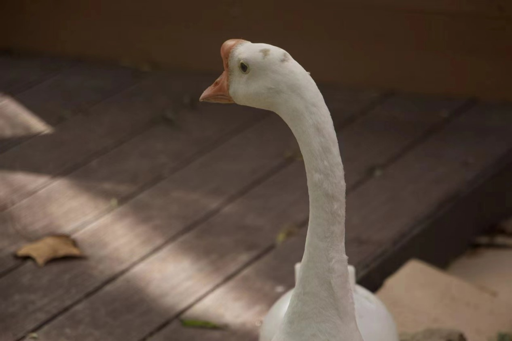
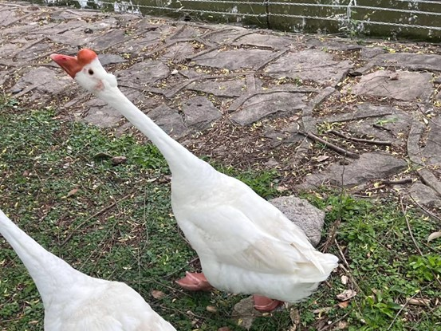
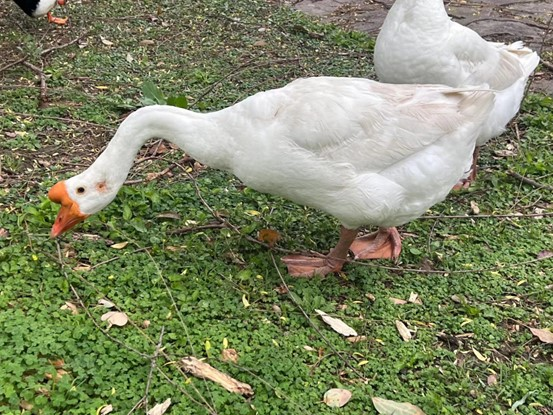
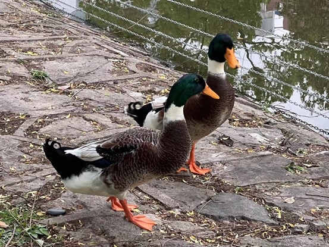
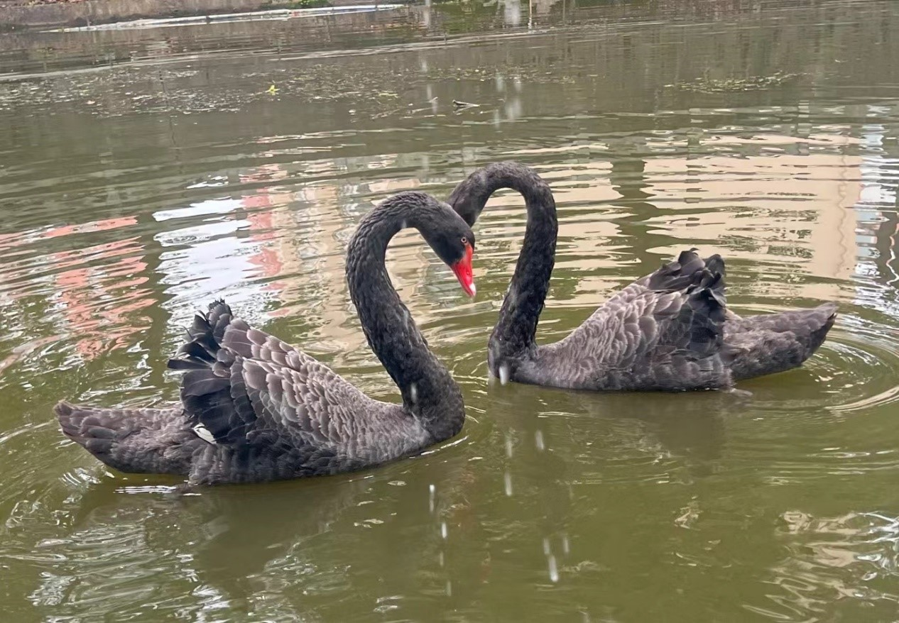
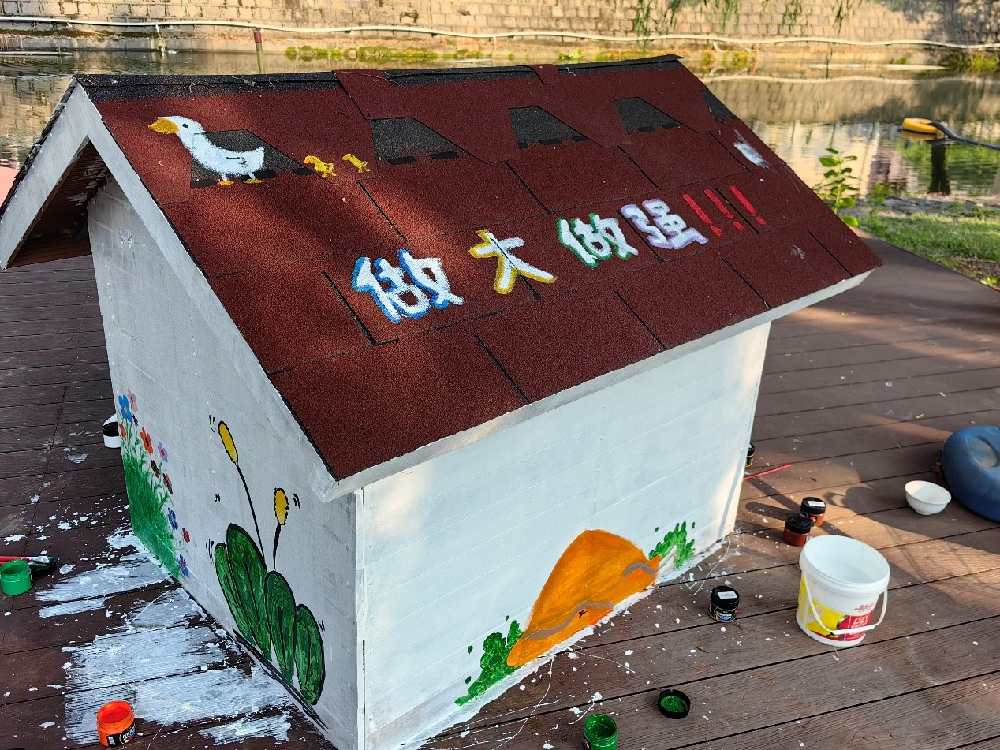

亲爱的朋友们，
感谢大家的热情参与，我们的动物命名活动圆满结束！经过激烈的投票与讨论，最终的名字终于出炉！🎉

# 后续新成员将以以下名字进行命名:

波比 红掌 清波 皮蛋 扁嘴仑 青羽 春江 鹄雅

# 📸 后续鹅社活动正在筹划，敬请关注！

届时，我们将邀请大家一起见证这些小家伙的新身份，并分享它们的日常趣事！

更多日常请在学校各个角落look他们的身影，也可到弘毅园对岸进行投喂（达利园小面包、红糖白面玉米馒头、青白菜、各色水果即可）

# 鹅社抖音号600473342.

再次感谢大家的参与与支持，期待在未来的活动中再见！🐾💕

💻 [小明](https://m1ng.space/) 写在 2024 年 09 月 22日
