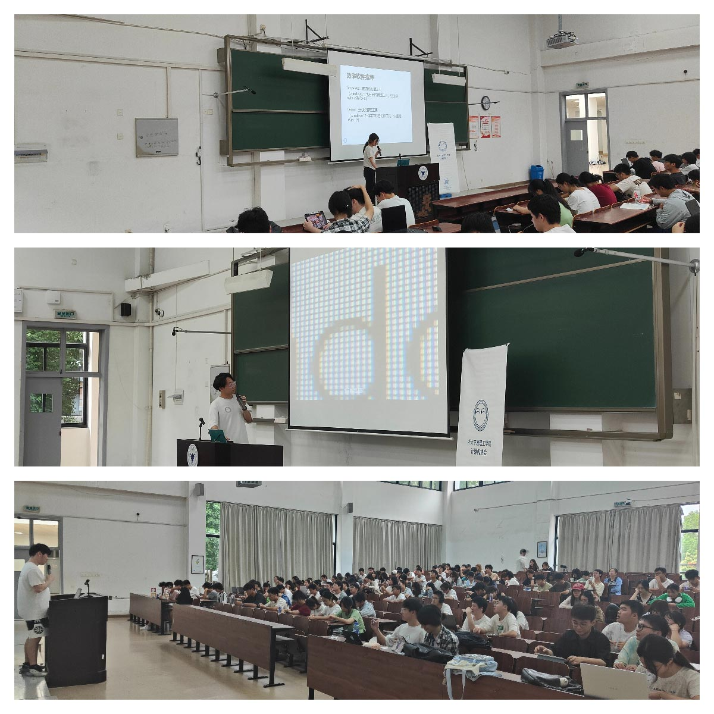
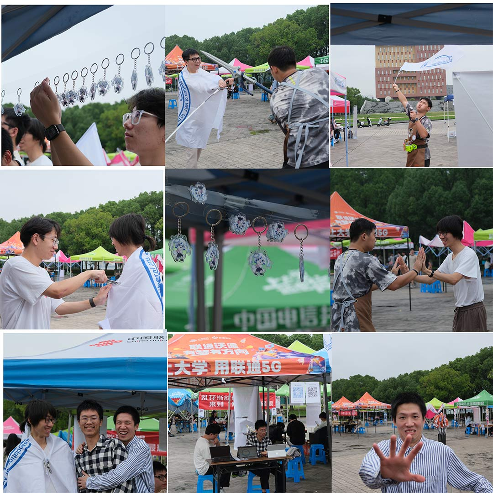
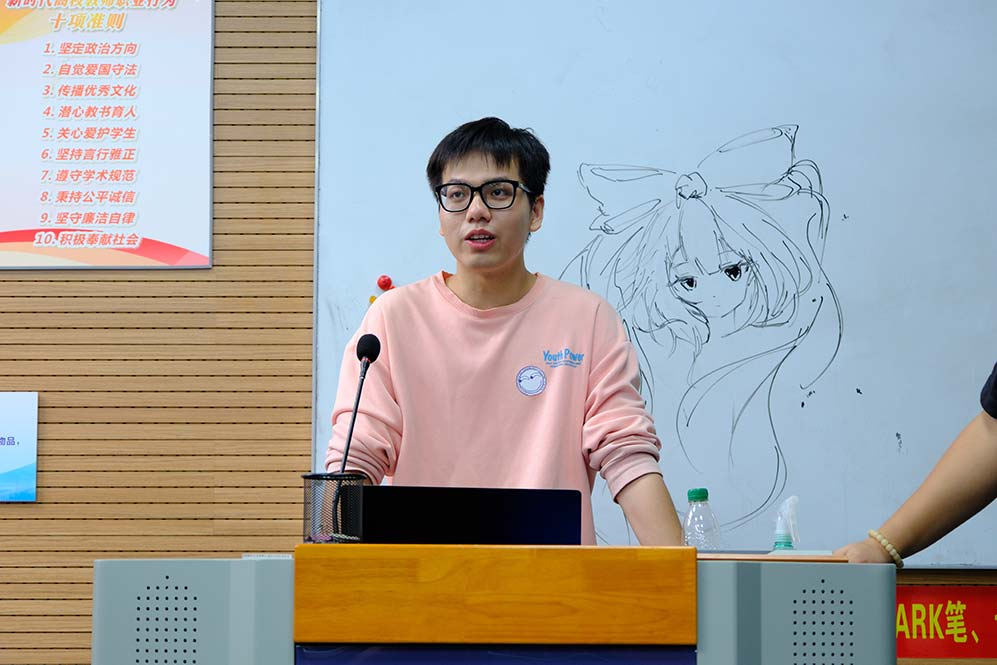
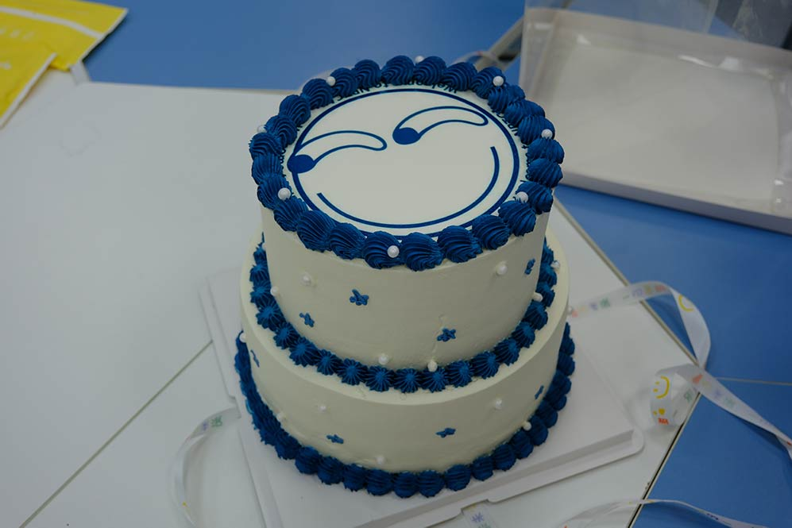
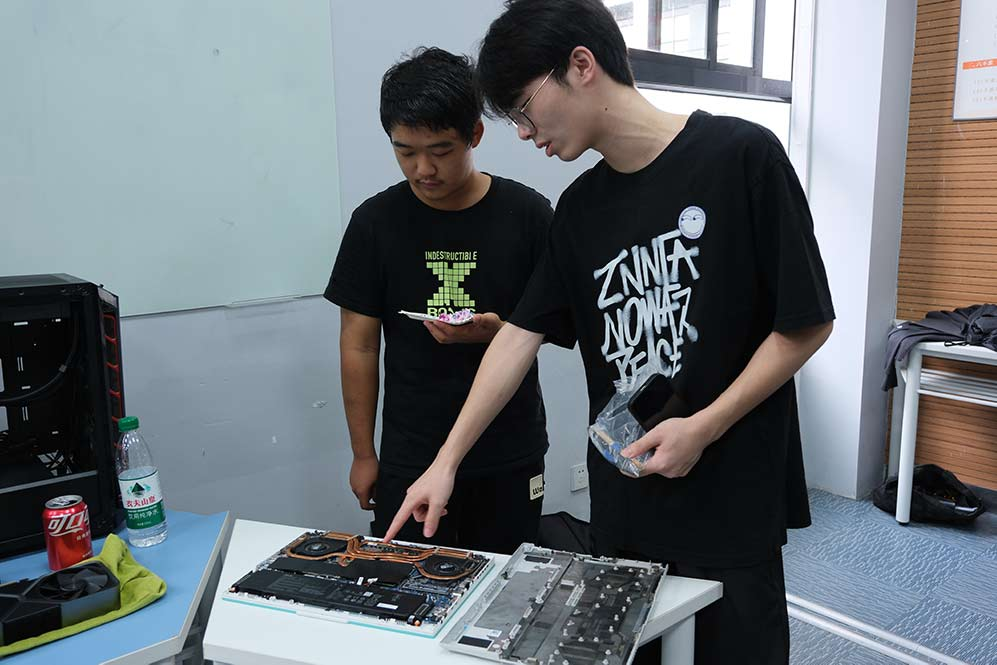
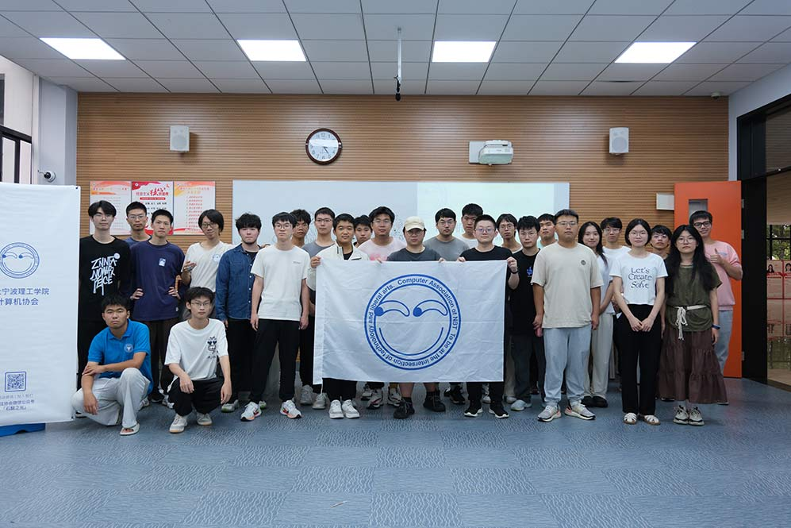

# 天气转凉，小心滑稽出没

  

    你是否在校园注意到这个LOGO吗？
     
    这是计算机协会的logo哦！
  

  

#### CA101讲座

2024.9.21  计算机协会成功举办新学年第一次科普性质的讲座。

本次讲座是计算机协会CA系列讲座中CA101类型，面向对象为电脑初学者。协会成员基于理工维修日的维修经验，进行一些科普性的介绍，目的是帮助同学们了解电脑的基本知识，以便更好维护和使用自己的电脑。副会长Orange Dog提到要避免使用电脑的一些误区，维修部部长则介绍了电脑的硬件及相关的功能，另一位小邱同学分享了一些实用的软件。

本次讲座持续大约一个半小时，当讲座分享到一些有趣的内容时候，同学们也会拿起手机拍下PPT内容，并表示希望将PPT分享出来。

#### 2024百团大战

2024.9.25   计算机协会在露天广场参与社团百团大战

全年唯一的百团大战，很不幸安排在了工作日。在同学都要上课的时间段内，本次活动的人流量没有以往百团大战的人数多，虽然如此，计协成员仍然积极筹备本次百团招新的活动，前期准备好，计协娘，贴纸等周边；安排人员到现场向前来询问社团的同学介绍计算机协会，分享协会 成员在做的事情。同时展现协会内部轻松愉快的氛围。

作为一个社团，前提是要玩的开心！计算机协会提供了一个平台，欢迎大家前来交流分享。

#### 迎新见面会

2024.10.14 计算机协会于NB101教室举办了迎新见面会。

本次活动是为了让新来计协的同志进一步了解计算机协会，同时让新老同志彼此认识一下。本次活动大致流程分为三个部分，社团介绍，欢迎新成员，分享经验。

2022级会长向新成员简单介绍社团历史，以及各个部门的职能。

计算机新老同志一起吃蛋糕，向新成员表示欢迎。

老同志分享拆机经验。

#### 合影留念

2024年度大合影

kongbai 写于2024.10.15