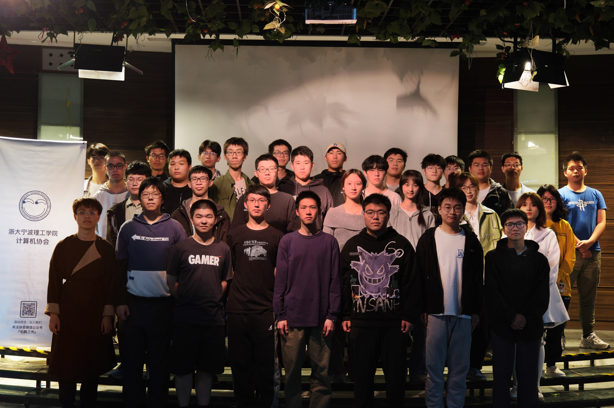

#

对NBTCA有很多[疑问](mailto:@nbtca.space)？没关系，让我们慢慢来。

# 目录

- [NBTCA是什么](#NBTCA是什么)
- [你们做什么](#你们做什么)
  - [维修日🧰](#维修日)
  - [讲座🎓](#讲座)
  - [看不见的地方🗿](#看不见的地方)
- [尾声](#尾声)
- [后记](#后记)
  - [v1.0后记](#v1.后记)

# NBTCA是什么❓

- 浙江大学宁波理工学院计算机协会（Association for Computing Machinery, Ningbo Institute of Technology, Zhejiang University ），今天的简写是[NBTCA🔗](https://github.com/nbtca/documents/blob/main/%E6%A1%A3%E6%A1%88/%E8%AE%A1%E7%AE%97%E6%9C%BA%E5%8D%8F%E4%BC%9A%E7%BA%B2%E8%A6%81)

# 你们做什么💻

- 准确说来取决于你的喜好，我们的一切都是[社员](https://en.wikipedia.org/wiki/Unus_pro_omnibus,_omnes_pro_uno)贡献的。

- 目前协会正在维护的工作包括但不限于下面的内容（需要注意的是，社内大部分人员都不一定是计算机相关的专业出身）

# 维修日🧰

- 志愿维护计算机设备，内部人员[维护面板🔧](https://repair.nbtca.space/)
- 周期性组织申请并举行维修日，非维修日时段，通过微信小程序[“NBT电脑维修”](此条目等待扩充)进行申报，等待社员处理。

# 讲座🎓

- CA101，致力于解决日常出现的计算机问题
- CA102，专注于讨论具体的技术问题而发起的研讨
- CA103，尝试和校园之外的人员交流沟通

- 组织申请并举办讲座，收集意见商讨改进活动。

# 看不见的地方🗿

- 上面的很多工作是由一群维护[服务器](https://i.nbtca.space/)和代码的同志提供服务支持的，所以我们在看不见的地方有一些工作，如果你希望参与进来，这里有一份[参考💾](此条目等待扩充)，当然你也可以[加入我们](此条目等待扩充)同我们一起研究。
- mc服务器建设[🎮](https://mc.nbtca.space/)
- 电子游戏竞赛？（你唠这个我可就不困了🤠）
- EDC、桌搭、摄影、户外？进来唠

# 尾声📲

- 这是一份简单的协会指南，希望能给来到这个页面的你一些帮助，如果对任何地方有问题欢迎[给我们提点意见](https://github.com/nbtca/Home/pulls)

# 后记📷

# v1.0后记

- 实际写起来发现缺的东西挺多的，不过比起入社的时候我们做了很多的事情，这同我们社员的工作分不开，实际上在工作中同朋友们学了很多东西，在一个相对长时间的学生组织工作后，在计协度过的时光对我来说显得弥足珍贵。
  当然，认识了一群非常有趣的朋友XD  
   
    
  

- 对了，这个条目还有蛮多东西没补充的，希望后来的同志帮忙补足修正，非常感谢！

💻 [小明](https://m1ng.space/) 写在2024年09月19日
